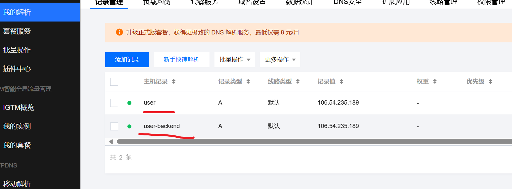
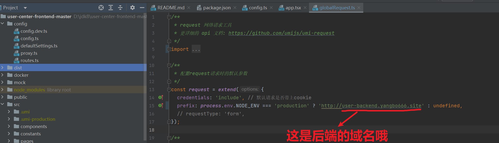
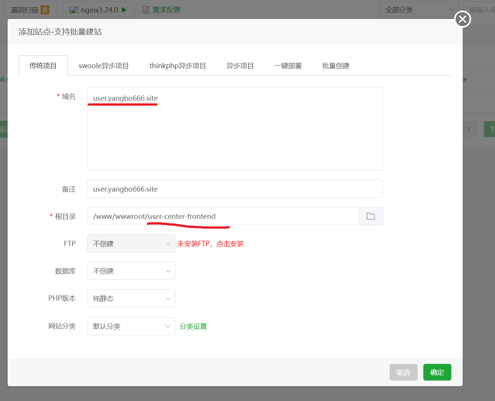
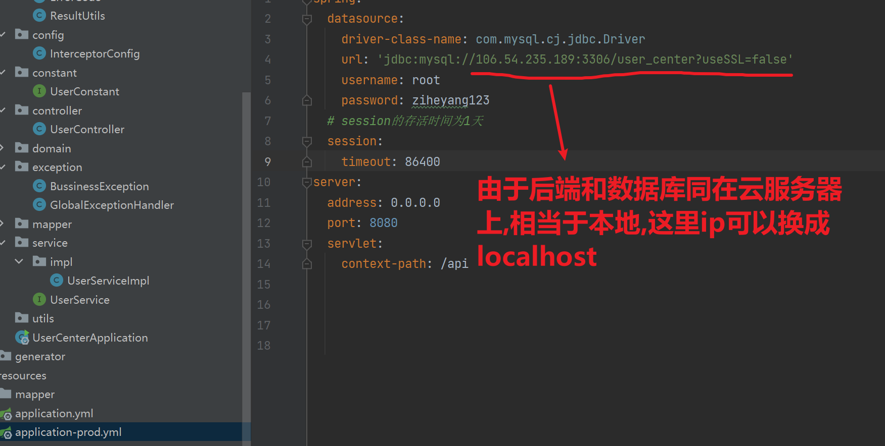
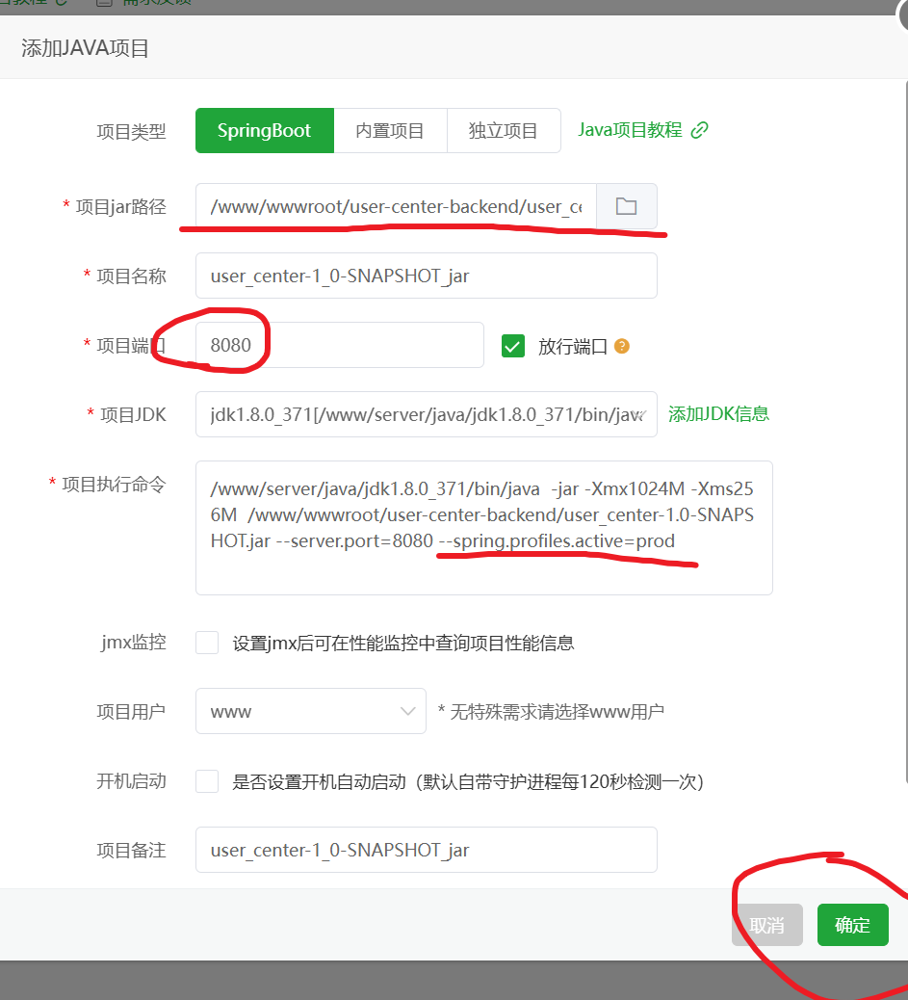
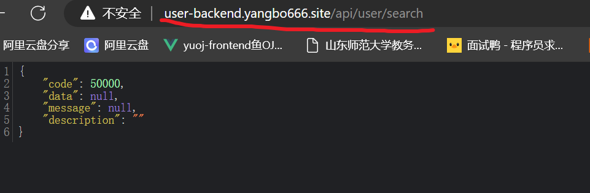
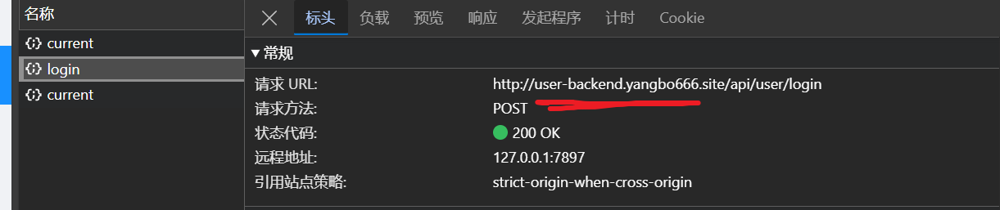
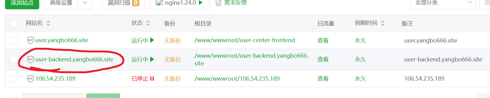
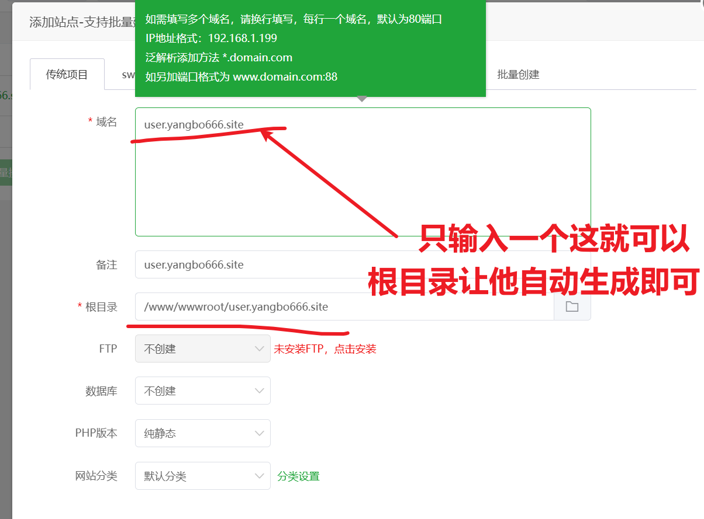
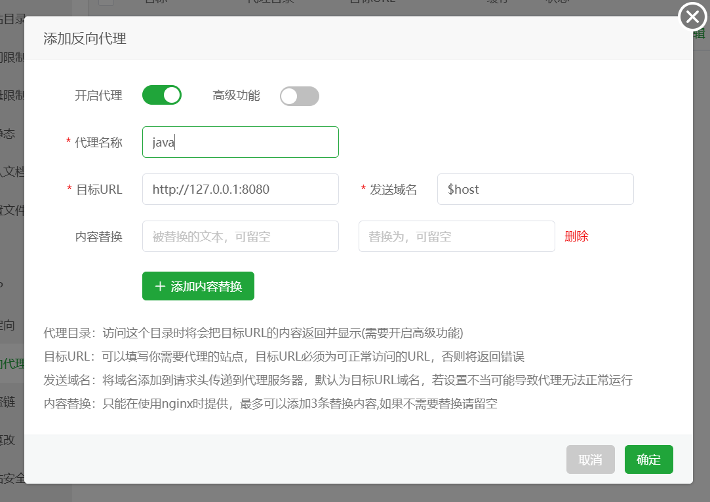

完结于2024.9.6.14.26
这是我自己完全部署的第一个项目,在此纪念一下.


# 1. 统一封装结果集,错误码,工具类

```java
@Data
public class BaseResponse<T> implements Serializable ()
{
    private int code;
    private T data;
    private String message;
    private String description;
    
    public BaseResponse(int code, T data, String message,String description)
    {
        this.code = code;
        this.data = data;
        this.message = message;
        this.description =description;
    }
    
    public BaseResponse(int code, T data)
    {
        this(code,data,"","");

    }
    public BaseResponse(ErrorCode errorCode)
    {
        this(errorCode.getCode(),
             null，
             errorCode.getMessage(),
             errorCode.getMessage());
    }
    
    
}
```

> 工具类： 避免手动new对象

```java
    
public class ResultUtils {
    public static <T>BaseResponse<T>success(T data)
    {
        return new BaseResponse<>(0,data,"ok","");

    }
    public static <T>BaseResponse<T>error(ErrorCode errorCode)
    {
        return new BaseResponse<>(errorCode);

    }
    public static BaseResponse error(int code,String message,String description)
    {
        return new BaseResponse(code,message,description);

    }
    public static BaseResponse error(ErrorCode errorCode,String message,String description)
    {
        return new BaseResponse(errorCode.getCode(),message,description);

    }

}
```

> 错误码枚举类

```Java
public enum ErrorCode {
    /**
     * 返回成功
     */
    SUCCESS(0,"ok",""),
    PARAMS_ERROR(40000,"请求参数错误",""),
    NULL_ERROR(40001,"请求数据为空",""),
    SYSTEM_ERROR(50000,"系统内部异常","");
    
    ErrorCode(int code, String message, String description) {     
        this.code = code;
        this.message = message;
        this.description = description;
    }
    
    public int getCode() {
        return code;
    }
    ...
```


# 2. 自定义异常类 和全局异常拦截器

> 继承RuntimeException , 多加了两个属性
>
> 可以接受,ErrorCOde这种多个字段封住的枚举类来作为参数;

```Java
public class BussinessException extends RuntimeException{
    /*
    * message是父类的
    * */
    private int code;
    private String description;
    public BussinessException(String message,int code, String description)
    {
        super(message);
        this.code = code;
        this.description = description;
    }
    public BussinessException(ErrorCode errorCode)
    {
        super(errorCode.getMessage());
        this.code = errorCode.getCode();
        this.description = errorCode.getDescription();

    }
    public BussinessException(ErrorCode errorCode,String description)
    {
        super(errorCode.getMessage());
        this.code = errorCode.getCode();
        this.description = errorCode.getDescription();
    }

    public int getCode() {
        return code;
    }

    public String getDescription() {
        return description;
    }

}
```

> 全局异常拦截器: 将后端的一些报错,以统一的结果集的格式返回,让用户那边同样能看到,具体的一些报错原因
>
> 和报错信息

```Java
@RestControllerAdvice
@Slf4j
public class GlobalExceptionHandler {
    @ExceptionHandler(BussinessException.class)
    public BaseResponse businessExceptionHandler(BussinessException e)
    {
        log.error("businessException: " + e.getMessage(),e);
        return ResultUtils.error(e.getCode(),e.getMessage(),e.getDescription());
    }
    @ExceptionHandler(RuntimeException.class)
    public BaseResponse runtimeExceptionHandler(RuntimeException e)
    {
        log.error("runtimeException"+ e.getMessage(),e);
        return ResultUtils.error(ErrorCode.SYSTEM_ERROR,e.getMessage(),"");
    }
}
```

# 3. 跨域处理

> 法1: 在config包下添加如下

```Java
@Configuration
public class InterceptorConfig implements WebMvcConfigurer {
    @Override
    public void addCorsMappings(CorsRegistry registry) {
        registry.addMapping("/**")
                .allowCredentials(true)
                .allowedOriginPatterns("*")
                .allowedMethods("POST", "GET", "PUT", "OPTIONS", "DELETE")
                .allowedHeaders("*")
                .exposedHeaders("*");
    }
}
```


# 4.域名上线版本

2. 申请两个域名记录如下:

   

   ```bash
   # 这两个记录会被当做
   user.yangbo666.site 被用来访问前端
   user-backend.yangbo66.site 被用来反向代理用哪个
   ```

   

   

3. 前端内容做如下修改,然后打包上传到宝塔的文件下

   

4. 创建前端网站,步骤如下,然后确定即可

   

5. 创建后端Java网站(记住是Java),步骤如下

   Package生成jar包,将jar包放到user-center包下面,(注意生产环境的配置文件是这样的)

   

   

6. 然后检查一下,情况是否如下两张图所示(---这一步很重要一定要检查一下)

   



1. 第6步创建反向Nginx代理,效果如下

   

   步骤: 

   添加PHP项目

   

   然后点击新建的这个项目的设置 ,在设置的左边栏找到,反向代理,添加如下的反向代理

   ```bash
   http://127.0.0.1:8080
   $host
   ```

   

   

   # 5.无域名上线版本

   将前端的GlobalRequest中的user-backend.yangbo666.site 改成 远程服务器ip+端口号,然后不需要再弄反向代理,剩下的步骤同上

   
